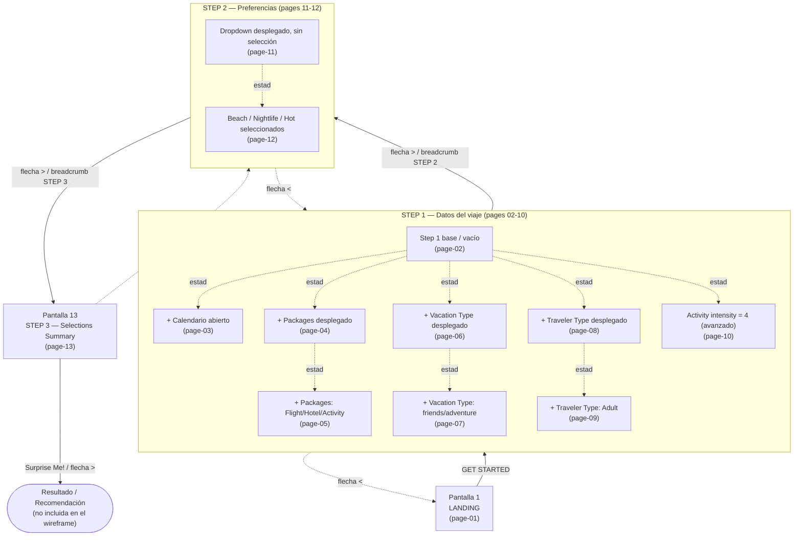

# Paradise Plan — Mapa de Pantallas y Flujo

## 1. Resumen ejecutivo

**Paradise Plan** es una aplicación móvil para planear *vacaciones sorpresa* personalizadas. En lugar de que el usuario elija un destino concreto, la app recopila sus preferencias (origen, fechas, presupuesto, tipo de paquete, tipo de viaje, intensidad de actividad y gustos) y genera una recomendación de paquete vacacional "sorpresa" ajustado a esos criterios.

La propuesta de valor se comunica desde la pantalla de inicio como un proceso de **3 pasos**:

1. **Plug in info** — datos base del viaje (fechas, salida, presupuesto, tipo de vacaciones).
2. **Select preferences** — filtros para personalizar el viaje.
3. **Find your surprise paradise** — paquete sorpresa con las mejores ofertas.

### Flujo general navegable

```
Landing ──► Step 1 (datos del viaje) ──► Step 2 (preferencias) ──► Step 3 (resumen) ──► Resultado ("Surprise Me!")
```

El wireframe documenta **13 pantallas**, pero el flujo real que recorre el usuario tiene solo **4 hitos** (Landing + 3 Steps). La mayoría de las pantallas intermedias son **variantes de estado del mismo formulario de Step 1**, capturando cada micro-interacción (calendario abierto, cada dropdown desplegado, opciones seleccionadas, intensidad elegida). Esto se detalla en la sección [Cómo se conectan](#7-cómo-se-conectan).

---

## 2. Diagrama de flujo

El siguiente diagrama agrupa las pantallas que pertenecen al mismo paso y distingue el flujo navegable real de las variantes de estado.



> **Lectura del diagrama:** las flechas sólidas (`──►`) son el flujo navegable real entre pasos. Las flechas punteadas internas (`-.estado.->`) NO son navegación: son distintos *estados/momentos* del mismo formulario capturados como pantallas separadas en el wireframe.

---

## 3. Pantallas del flujo principal (hitos navegables)

### Pantalla 1 — Pantalla de inicio (Landing)

- **Archivo:** `page-01.png`
- **Grupo/Paso:** Landing
- **Propósito:** Pantalla de aterrizaje que presenta la propuesta de valor (vacaciones sorpresa según tus intereses) y sirve de punto de entrada al flujo de 3 pasos mediante el botón **GET STARTED**.
- **Elementos de UI:**
  - Barra de navegación superior gris con iconos: buscar, home (activo/resaltado), menú/lista, info (i), teléfono, contacto/tarjeta, carrito.
  - Logo **PARADISE PLAN** con palmera y maleta amarilla con X roja.
  - Tagline hero: *"Plan your paradise vacation today"*.
  - Banner azul *"Know based on your interests"*.
  - Tres chips azules: **where to go**, **what to do**, **where to stay**.
  - Imagen hero (paisaje tropical) con CTA central **GET STARTED** sobre recuadro blanco semitransparente.
  - Indicador de pasos 1-2-3 (círculos rojos) con descripción de cada paso.
  - Footer gris **Contact Us** con placeholders y botones **sign in** / **login**.
- **Estado mostrado:** Landing en reposo. Home activo en la nav. Chips sin selección. Pasos 1-2-3 como indicadores informativos (no selectores). GET STARTED listo. Footer con campos vacíos.
- **Interacciones:** Pulsar GET STARTED; pulsar chips de interés; pulsar el banner; usar iconos de la barra superior; sign in / login; consultar Contact Us.
- **Conduce a:** GET STARTED → **Step 1** (page-02). sign in/login → autenticación. Iconos superiores → sus secciones respectivas.

---

### Pantalla 11 — Step 2: Preferencias (dropdown desplegado, sin selección)

- **Archivo:** `page-11.png`
- **Grupo/Paso:** Step 2
- **Propósito:** Paso 2 del flujo donde el usuario elige sus preferencias de viaje (*select all that apply*) agrupadas en **GENERAL** y **WEATHER**, para personalizar la sorpresa.
- **Elementos de UI:**
  - Barra de navegación superior gris (buscar, home activo, menú, info, teléfono, contacto, carrito).
  - Logo **PARADISE PLAN**.
  - Breadcrumbs: STEP 1 (inactivo), **STEP 2** (relleno verde, activo), STEP 3 (inactivo).
  - Banner verde **STEP 2**.
  - Riel/indicador vertical gris a la izquierda del contenido.
  - Título *"\* Prefrences Dropdown"* (asterisco rojo, *Prefrences* escrito así) + subtexto *"\*Select all that apply"*.
  - Grupo **GENERAL**: Beach, Nightlife, Activities, Museums, Historic, Good food, Nature, Luxury, Hidden, Touristic staples, Cruises (círculos vacíos).
  - Grupo **WEATHER**: Hot, cold, windy, perfect, medium, snow (círculos vacíos).
  - Barra de scroll vertical (flechas arriba/abajo, thumb arriba).
  - Flechas de navegación `<` `>`.
  - Footer **Contact Us** con **sign in** / **login**.
- **Estado mostrado:** Vacío / sin selección. Todas las opciones de GENERAL y WEATHER con círculos vacíos. Scroll en posición superior. STEP 2 activo.
- **Interacciones:** Seleccionar varias opciones (multi-selección); hacer scroll; avanzar con `>`; retroceder con `<`; saltar entre pasos con breadcrumbs; nav superior; sign in / login.
- **Conduce a:** `>` / breadcrumb STEP 3 → **Step 3** (page-13). `<` / breadcrumb STEP 1 → **Step 1**. Seleccionar opciones → mismo formulario con marcas (page-12).

---

### Pantalla 12 — Step 2: Preferencias con Beach, Nightlife y Hot seleccionados

- **Archivo:** `page-12.png`
- **Grupo/Paso:** Step 2
- **Propósito:** Mismo Paso 2, mostrando el formulario con varias preferencias ya marcadas (estado posterior a la interacción de selección).
- **Elementos de UI:** Iguales a la page-11 (barra superior, logo, breadcrumbs con STEP 2 activo, banner verde, título *Prefrences Dropdown*, secciones GENERAL y WEATHER, barra de scroll, flechas de navegación, footer con sign in/login).
- **Estado mostrado:** Con selecciones activas. En **GENERAL**: *Beach* y *Nightlife* rellenos; el resto vacíos. En **WEATHER**: *Hot* relleno; el resto vacíos. STEP 2 activo. Flecha derecha en verde (avance habilitado), izquierda gris. Scroll cerca del tope.
- **Interacciones:** Seleccionar/deseleccionar opciones; scroll; avanzar con `>` verde; retroceder con `<`; breadcrumbs; nav superior; sign in / login; Contact Us.
- **Conduce a:** `>` verde / breadcrumb STEP 3 → **Step 3** (page-13). `<` / STEP 1 → **Step 1**.

---

### Pantalla 13 — Resumen de Selecciones (Step 3)

- **Archivo:** `page-13.png`
- **Grupo/Paso:** Step 3
- **Propósito:** Pantalla final del flujo que muestra el resumen consolidado de todas las selecciones previas, para que el usuario revise antes de generar la recomendación con **Surprise Me!**.
- **Elementos de UI:**
  - Barra de navegación superior gris (home activo/resaltado).
  - Logo **PARADISE PLAN**.
  - Breadcrumbs: STEP 1, STEP 2 (inactivos), **STEP 3** (relleno verde, activo).
  - Banner verde **STEP 3**.
  - Título **Selections Summary** con campos:
    - `Departure:` (sin valor)
    - `Dates:` (sin valor)
    - `# of travelers` (sin valor)
    - `Budget range: $$$-$$$`
    - `Packages: Flight, hotel, activity`
    - `Vacation Type: Friends, Adventure`
    - `Traveler Type: Adult`
    - `Activity Level: 4`
    - `Filters: Beach, nightlife, hot`
  - Icono de lupa + botón CTA amarillo grande **"Suprise Me!"** (escrito así, con error tipográfico).
  - Flechas de navegación `<` `>`.
  - Footer **Contact Us** con **sign in** / **login**.
- **Estado mostrado:** Revisión/visualización (no editable, sin dropdowns). STEP 3 activo. Los tres primeros campos (Departure, Dates, # of travelers) **vacíos**; el resto poblados con selecciones previas. Botón Suprise Me! listo.
- **Interacciones:** Pulsar **Suprise Me!** para generar la recomendación; `<` → Step 2; `>` → resultados; breadcrumbs para reeditar pasos; nav superior; sign in / login; Contact Us.
- **Conduce a:** **Suprise Me!** / `>` → **pantalla de resultados/recomendación** (no incluida en el wireframe). `<` → **Step 2**. Breadcrumbs STEP 1/STEP 2 → reeditar selecciones.

---

## 4. Step 1 — Variantes de estado del mismo formulario (pages 02-10)

> Las nueve pantallas siguientes son **el mismo formulario de Step 1** capturado en distintos momentos de interacción. Comparten estructura: barra superior, logo, breadcrumbs (STEP 1 activo en verde), banner verde STEP 1, los campos del formulario y el footer. Solo cambia **qué está abierto/seleccionado**.

### Pantalla 2 — Step 1: Formulario de preferencias (vacío)

- **Archivo:** `page-02.png`
- **Grupo/Paso:** Step 1 (estado base)
- **Propósito:** Estado inicial del formulario donde el usuario captura los parámetros base del viaje (origen, fechas, viajeros, presupuesto, paquete, tipo de viaje) antes de avanzar a Step 2.
- **Elementos de UI:** Barra superior gris (home activo); logo; breadcrumbs **STEP 1** activo / STEP 2 / STEP 3; banner verde STEP 1; campos `departure point*`, `dates*` (+ icono calendario), `# of travelers*` (stepper, valor 2), `Budget range*` ($$$ – $$$), dropdowns `Packages*`, `Vacation Type*`, `Traveler Types*`, `Optional: Max distance`, selector **Activity intensity** (low 1-2-3-4-5 high), `Optional: Destination`; flechas `<` `>`; footer Contact Us con sign in/login.
- **Estado mostrado:** Vacío/inicial. Todos los campos de texto con placeholder; dropdowns cerrados; único valor prellenado `# of travelers = 2`; Activity intensity sin nivel seleccionado; sin estados de error pese a los asteriscos rojos.
- **Interacciones:** Rellenar cada campo, ajustar viajeros con stepper, abrir calendario, abrir cada dropdown, elegir intensidad 1-5; navegar `<` / `>`; breadcrumbs; nav superior; sign in / login.
- **Conduce a:** `>` / breadcrumb STEP 2 → **Step 2** (page-11). `<` → **Landing**. sign in/login → autenticación.

### Pantalla 3 — Step 1 con calendario abierto

- **Archivo:** `page-03.png`
- **Grupo/Paso:** Step 1 (sub-estado: date picker)
- **Propósito:** Momento en que el usuario tocó el campo `dates` y se abrió el popup de calendario para elegir la fecha de salida.
- **Elementos de UI:** Igual que page-02, más el **popup de calendario** con título *"When are you departing?"*, radio buttons *"Pick your preferred departure date"* (vacío) y *"Select other dates to consider"* (seleccionado), cuadrícula del mes **MAY** (Sun–Sat, 1-31) con flechas de mes `< >`, y botones **Back** (gris) / **Confirm** (azul).
- **Estado mostrado:** Calendario abierto superpuesto a la derecha. Radio *"Select other dates to consider"* seleccionado. Resto de campos obligatorios vacíos; `# of travelers = 2`. STEP 1 activo.
- **Interacciones:** Elegir día; navegar meses con `< >`; alternar radio buttons; **Confirm** (aplicar) o **Back** (cancelar); resto de interacciones del formulario.
- **Conduce a:** **Confirm** → cierra popup y rellena `dates` (vuelve a Step 1). `>` → **Step 2**. `<` → pantalla anterior.

### Pantalla 4 — Step 1: Packages desplegado (sin selección)

- **Archivo:** `page-04.png`
- **Grupo/Paso:** Step 1 (sub-estado: dropdown Packages abierto)
- **Propósito:** Captura del tipo de paquete; el grupo **Packages** aparece desplegado con sus opciones para marcar todas las que apliquen.
- **Elementos de UI:** Igual que page-02, con el **dropdown Packages desplegado**: etiqueta *Packages\** + subtexto *"\*select all that apply"* y 5 opciones con círculos vacíos: **Flight, Hotel, Activity, Car, Cruise**.
- **Estado mostrado:** Packages desplegado pero sin selección (5 círculos vacíos). Resto vacío; `# of travelers = 2`; Activity intensity sin selección. STEP 1 activo.
- **Interacciones:** Marcar una o varias opciones de Packages; expandir/contraer categorías; resto de interacciones del formulario; navegar `<` / `>`.
- **Conduce a:** `>` / breadcrumb STEP 2 → **Step 2**. `<` → pantalla previa. Selección → page-05.

### Pantalla 5 — Step 1: Packages con Flight, Hotel y Activity seleccionados

- **Archivo:** `page-05.png`
- **Grupo/Paso:** Step 1 (sub-estado: Packages con selección)
- **Propósito:** Variante con varias opciones de Packages marcadas; al marcar **Activity** se revelan los controles condicionales de actividad.
- **Elementos de UI:** Igual que page-04, con **Flight, Hotel, Activity** seleccionados (círculos rellenos) y **Car, Cruise** vacíos. Visibles los controles condicionales: `Optional: Max distance`, **Activity intensity** (1-5) y `Optional: Destination`. Dropdowns de Packages cerrados.
- **Estado mostrado:** Flight/Hotel/Activity seleccionados; Car/Cruise no. Activity intensity sin nivel resaltado. Campos de texto vacíos; `# of travelers = 2`. STEP 1 activo.
- **Interacciones:** Marcar/desmarcar paquetes; rellenar Max distance y Destination; elegir intensidad 1-5; navegar `<` / `>`.
- **Conduce a:** `>` → **Step 2**. `<` → Landing/pantalla previa.

### Pantalla 6 — Step 1 con dropdown Vacation Type abierto

- **Archivo:** `page-06.png`
- **Grupo/Paso:** Step 1 (sub-estado: dropdown Vacation Type abierto)
- **Propósito:** Captura del tipo de vacación; el dropdown **Vacation Type** se despliega como lista de selección múltiple.
- **Elementos de UI:** Igual que page-02, con **Vacation Type desplegado**: subtexto *"\*select all that apply"* y opciones con círculos vacíos: **family, friends, adventure, discovery, lone wolf**. Packages cerrado. Activity intensity (1-5). `Optional: Destination`.
- **Estado mostrado:** Vacation Type abierto, ninguna opción marcada. Resto vacío; `# of travelers = 2`. STEP 1 activo.
- **Interacciones:** Marcar una o varias opciones de Vacation Type; resto de campos; intensidad 1-5; navegar `<` / `>`.
- **Conduce a:** `>` → **Step 2**. `<` → Landing/previa. Selección → page-07.

### Pantalla 7 — Step 1: Vacation Type seleccionado (friends, adventure)

- **Archivo:** `page-07.png`
- **Grupo/Paso:** Step 1 (sub-estado: Vacation Type con selección)
- **Propósito:** Variante con **friends** y **adventure** marcados en la lista de selección múltiple de Vacation Type.
- **Elementos de UI:** Igual que page-06, con la lista mostrando **friends** y **adventure** seleccionados (rellenos) y **family, discovery, lone wolf** vacíos.
- **Estado mostrado:** Vacation Type expandido con friends/adventure seleccionados. Resto de campos vacíos; `# of travelers = 2`; Activity intensity sin selección. STEP 1 activo.
- **Interacciones:** Seleccionar/deseleccionar tipos; rellenar resto; intensidad 1-5; navegar `<` / `>`; nav superior; sign in / login.
- **Conduce a:** `>` → **Step 2**. `<` → pantalla anterior. Breadcrumbs STEP 2/STEP 3 para saltar.

### Pantalla 8 — Step 1 con dropdown Traveler Type abierto

- **Archivo:** `page-08.png`
- **Grupo/Paso:** Step 1 (sub-estado: dropdown Traveler Type abierto)
- **Propósito:** Captura de quién viaja; el dropdown **Traveler Type** se despliega con opciones multi-selección, solapándose sobre los controles inferiores.
- **Elementos de UI:** Igual que page-02, con **Traveler Type desplegado**: subtexto *"\*select all that apply"* y opciones con círculos vacíos: **Adult, Children, Advanced Age**. El menú tapa parcialmente la escala low-high y un campo a su derecha. `Optional: Destination`.
- **Estado mostrado:** Traveler Type abierto, ninguna opción marcada. Resto vacío; `# of travelers = 2`. STEP 1 activo.
- **Interacciones:** Marcar Adult/Children/Advanced Age; cerrar el dropdown; resto de campos; navegar `<` / `>`.
- **Conduce a:** `>` / breadcrumb STEP 2 → **Step 2**. `<` → pantalla previa. Selección → page-09.

### Pantalla 9 — Step 1: Traveler Type con Adult seleccionado

- **Archivo:** `page-09.png`
- **Grupo/Paso:** Step 1 (sub-estado: Traveler Type con selección)
- **Propósito:** Variante con **Adult** seleccionado en el dropdown Traveler Type expandido.
- **Elementos de UI:** Igual que page-08, con **Adult** seleccionado (círculo relleno) y **Children, Advanced Age** vacíos. Escala low 1-2-3-4-5 high. `Optional: Destination`.
- **Estado mostrado:** Traveler Type abierto con Adult marcado. Resto de campos vacíos; `# of travelers = 2`; intensidad sin selección. STEP 1 activo.
- **Interacciones:** Seleccionar tipos de viajero (multi-selección); resto de campos; intensidad 1-5; navegar `<` / `>`; nav superior; sign in / login.
- **Conduce a:** `>` → **Step 2**. `<` → Landing/paso previo.

### Pantalla 10 — Step 1: Formulario en estado avanzado (intensidad = 4)

- **Archivo:** `page-10.png`
- **Grupo/Paso:** Step 1 (sub-estado: intensidad seleccionada, listo para avanzar)
- **Propósito:** Variante en interacción avanzada, con `# of travelers` definido y un nivel de **Activity intensity** seleccionado, lista para pasar a Step 2.
- **Elementos de UI:** Igual que page-02; todos los dropdowns cerrados. Control **Activity intensity** con el nivel **4 resaltado/seleccionado** (relleno gris); niveles 1, 2, 3, 5 sin seleccionar.
- **Estado mostrado:** Campos obligatorios de texto y dropdowns aún vacíos; `# of travelers = 2`; opcionales vacíos; **Activity intensity = 4**. STEP 1 activo; ningún dropdown abierto.
- **Interacciones:** Rellenar campos; abrir dropdowns; cambiar intensidad (actualmente 4); navegar `<` / `>`; nav superior; sign in / login; Contact Us.
- **Conduce a:** `>` / breadcrumb STEP 2 → **Step 2** (page-11). `<` → Landing/pantalla anterior.

---

## 5. Mapa de pantalla a archivo

| Pantalla | Archivo | Grupo | Rol en el flujo |
|---|---|---|---|
| 1 | `page-01.png` | Landing | Hito navegable |
| 2 | `page-02.png` | Step 1 | Estado base del formulario |
| 3 | `page-03.png` | Step 1 | Sub-estado: calendario abierto |
| 4 | `page-04.png` | Step 1 | Sub-estado: Packages abierto |
| 5 | `page-05.png` | Step 1 | Sub-estado: Packages seleccionados |
| 6 | `page-06.png` | Step 1 | Sub-estado: Vacation Type abierto |
| 7 | `page-07.png` | Step 1 | Sub-estado: Vacation Type seleccionado |
| 8 | `page-08.png` | Step 1 | Sub-estado: Traveler Type abierto |
| 9 | `page-09.png` | Step 1 | Sub-estado: Traveler Type seleccionado |
| 10 | `page-10.png` | Step 1 | Sub-estado: intensidad = 4 (listo) |
| 11 | `page-11.png` | Step 2 | Hito navegable (sin selección) |
| 12 | `page-12.png` | Step 2 | Sub-estado: preferencias seleccionadas |
| 13 | `page-13.png` | Step 3 | Hito navegable (resumen + CTA) |

---

## 6. Campos capturados por paso

| Paso | Campos / controles | Obligatorio |
|---|---|---|
| **Step 1** | departure point | Sí (\*) |
| | dates (+ calendario) | Sí (\*) |
| | # of travelers (stepper, default 2) | Sí (\*) |
| | Budget range ($$$ – $$$) | Sí (\*) |
| | Packages: Flight, Hotel, Activity, Car, Cruise | Sí (\*) |
| | Vacation Type: family, friends, adventure, discovery, lone wolf | Sí (\*) |
| | Traveler Type: Adult, Children, Advanced Age | Sí (\*) |
| | Optional: Max distance | No |
| | Activity intensity (1–5) | No (implícito) |
| | Optional: Destination | No |
| **Step 2** | Preferencias GENERAL: Beach, Nightlife, Activities, Museums, Historic, Good food, Nature, Luxury, Hidden, Touristic staples, Cruises | Sí (\*) |
| | Preferencias WEATHER: Hot, cold, windy, perfect, medium, snow | Sí (\*) |
| **Step 3** | (Solo lectura) Resumen + botón Surprise Me! | — |

---

## 7. Cómo se conectan

### Flujo navegable real (lo que recorre un usuario)

```
Landing (1) ──► Step 1 (formulario) ──► Step 2 (preferencias) ──► Step 3 (resumen) ──► Resultado
```

Solo existen **cuatro hitos** que el usuario atraviesa secuencialmente, más una pantalla de resultado no incluida en el wireframe:

- **Pantalla 1 (Landing)** → con **GET STARTED** entra a Step 1.
- **Step 1** (representado por las pantallas 2–10) → con la flecha `>` o el breadcrumb **STEP 2** avanza a Step 2.
- **Step 2** (pantallas 11–12) → con `>` o **STEP 3** avanza a Step 3.
- **Pantalla 13 (Step 3)** → con **Surprise Me!** o `>` genera el resultado.

La navegación es **bidireccional** dentro del flujo: las flechas `<` `>` y los tres breadcrumbs (**STEP 1 / STEP 2 / STEP 3**) presentes en todas las pantallas de pasos permiten saltar libremente entre los tres pasos.

### Pasos secuenciales reales vs. variantes de estado

Es clave distinguir dos tipos de pantallas en este wireframe:

**A. Pasos secuenciales reales (transiciones de navegación):**
- Pantalla 1 (Landing) → Step 1
- Step 1 → Step 2 (pantalla 11)
- Step 2 → Step 3 (pantalla 13)
- Step 3 → Resultado

**B. Variantes de estado del MISMO paso (micro-interacciones, no navegación):**

- **Step 1 → pantallas 2 a 10 (9 variantes):** todas son **el mismo formulario** capturado en momentos distintos. La pantalla 2 es el estado base; las demás documentan micro-interacciones puntuales:
  - page-03: el popup de **calendario** abierto.
  - page-04 / page-05: el dropdown **Packages** abierto / con opciones marcadas.
  - page-06 / page-07: el dropdown **Vacation Type** abierto / con opciones marcadas.
  - page-08 / page-09: el dropdown **Traveler Type** abierto / con Adult marcado.
  - page-10: el formulario con **Activity intensity = 4** (estado "listo para avanzar").

  El usuario **no navega de la pantalla 2 a la 3 a la 4**: permanece en una sola pantalla de Step 1 y, conforme toca campos, esa misma pantalla pasa por estos estados. El wireframe los separa solo para documentar cada interacción.

- **Step 2 → pantallas 11 y 12 (2 variantes):** misma pantalla de preferencias. La 11 muestra el dropdown sin selección y la 12 con **Beach, Nightlife, Hot** marcados. Es el mismo paso antes y después de seleccionar.

**Trazabilidad de datos hacia el resumen.** La pantalla 13 (Step 3) confirma que los pasos previos alimentan el resumen: muestra `Packages: Flight, hotel, activity` (de page-05), `Vacation Type: Friends, Adventure` (de page-07), `Traveler Type: Adult` (de page-09), `Activity Level: 4` (de page-10) y `Filters: Beach, nightlife, hot` (de page-12). El wireframe está internamente consistente: las selecciones de las variantes se reflejan en el resumen final.

> **En resumen:** de 13 pantallas, el flujo navegable real son **4 hitos** (Landing + 3 Steps). Las **9 pantallas de Step 1** y las **2 de Step 2** son variantes de estado de dos pantallas, no pasos adicionales.

---

## 8. Observaciones de UX / inconsistencias

### Errores de ortografía visibles en el wireframe
- **"Prefrences"** en lugar de *Preferences* — título del campo en Step 2 (pages 11 y 12).
- **"Suprise Me!"** en lugar de *Surprise Me!* — botón CTA principal del Step 3 (page-13). Es el botón más importante de la app; conviene corregirlo antes de cualquier diseño final.

### Consistencia del header / barra superior
- El número de iconos descritos en la barra superior **varía entre pantallas** (algunas listan 6 iconos, otras 7). Conviene fijar un set canónico de iconos y su orden.
- El logo se describe a veces como *"palmera y maleta amarilla con X roja"* (landing) y otras como *"maleta amarilla, palmera y avión rojo"* (Step 1). Hay que unificar la versión del logo.
- El estilo del **header del paso cambia**: la Landing usa indicadores de pasos con **círculos rojos numerados (1-2-3)**, mientras que los Steps usan **breadcrumbs verdes (STEP 1 / 2 / 3)** + un banner verde. Son dos lenguajes visuales distintos para representar el mismo proceso de 3 pasos.

### Campos que aparecen / desaparecen (lógica condicional)
- En **Step 1**, los controles `Optional: Max distance`, `Activity intensity` y `Optional: Destination` parecen **condicionales a la selección de "Activity"** en Packages (page-05). Conviene documentar explícitamente esta lógica de mostrar/ocultar, ya que afecta la altura del formulario.
- La etiqueta del campo de tipo de viajero aparece como **"Traveler Types"** (plural, pages 02/10) y como **"Traveler Type"** (singular, pages 08/09/13). Unificar.

### Validación y obligatoriedad
- Múltiples campos tienen **asterisco rojo de obligatorio**, pero **ningún estado de error o validación** está representado en el wireframe (ni en Step 1 vacío). Falta documentar qué pasa si el usuario intenta avanzar sin completar los obligatorios.
- En **Step 3**, los campos `Departure:`, `Dates:` y `# of travelers` aparecen **vacíos** en el resumen, pese a ser obligatorios en Step 1. Esto sugiere o bien un wireframe incompleto, o un bug de mapeo: el resumen debería reflejar también esos tres campos. Es una inconsistencia a resolver.

### Patrones de control inconsistentes
- Las opciones multi-selección (*select all that apply*) se representan con **círculos tipo radio button**, cuando semánticamente deberían ser **checkboxes** (los radio buttons implican selección única). Esto puede confundir al usuario sobre si puede elegir varias.
- En el **calendario** (page-03), el radio *"Select other dates to consider"* aparece preseleccionado en lugar de *"Pick your preferred departure date"*. Conviene revisar cuál debería ser el valor por defecto.
- La **Activity intensity** no muestra ningún valor por defecto seleccionado en el estado base (1-5 todos vacíos), lo que puede dejar ambiguo el valor inicial.

### Navegación
- Existe **doble mecanismo de navegación** redundante entre pasos: flechas `<` `>` Y breadcrumbs clicables. Hay que asegurar que ambos sean consistentes (p. ej., que las flechas respeten la validación igual que los breadcrumbs).
- El color de la flecha `>` cambia entre gris y verde según la pantalla (gris en Step 1, verde en page-12), lo que podría señalar "avance habilitado/deshabilitado" pero no se aplica de forma consistente. Definir el significado del color.

### Pantalla faltante
- El **resultado/recomendación** al que conduce *Surprise Me!* **no está incluido** en el wireframe. Es el desenlace de la propuesta de valor ("vacaciones sorpresa") y debería diseñarse como pantalla 14.