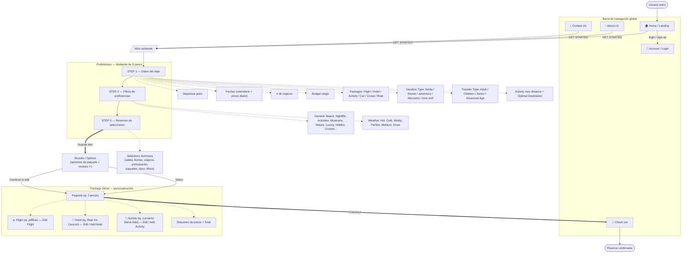

# Flujo de la App — Paradise Plan (UI)

> Reconstruido a partir de las diapositivas de UI en `project-base/PP/` (20 láminas;
> las láminas 4, 11, 13, 14, 17 y 19 están en blanco).
> Paradise Plan es una app de reserva de viajes **orientada a presupuesto y preferencias**,
> no a destino: el usuario define qué quiere y el sistema le entrega un "paquete sorpresa".

---

## Diagrama de flujo (Mermaid)



---

## Flujo en texto

### 1. Entrada — Home / Landing (lámina 1)
- Hero "**Paradise Plan — Plan your paradise vacation today**" con botón **GET STARTED**.
- Explica la propuesta en **3 pasos**:
  1. **Plug in info** — fechas, salida, presupuesto, tipos de vacaciones, etc.
  2. **Select from preference filter menu** — personalizar el viaje.
  3. **Find your surprise paradise package** — con las mejores ofertas.
- **Navegación global** (presente en todas las pantallas): Home · Preferences · About Us · Contact Us · Account · Check out · Search.
- **Footer**: bloque "Contact Us" y "Log in or make an account" (login / sign up).

### 2. Preferences — Asistente de 3 pasos (láminas 2, 3, 7, 8, 9, 10, 12, 15)
Pantalla de tres columnas: **STEP 1 → STEP 2 → STEP 3**.

**STEP 1 — Datos del viaje** (formulario con desplegables):
- Departure point.
- **Fechas** mediante calendario con precio diario (lámina 7).
- # de viajeros.
- Budget range.
- **Packages** (desplegable, lámina 8): Flight, Hotel, Activity, Car, Cruise, Boat.
- **Vacation Type** (desplegable, lámina 9): family, friends, adventure, discovery, lone wolf.
- **Traveler Type** (desplegable, lámina 15): Adult, Children, Senior, Advanced Age.
- Activity max distance y Optimal Destination (opcionales).

**STEP 2 — Filtros de preferencias** (lámina 12, "Preferences Dropdown"):
- **General**: Beach, Nightlife, Activities, Museums, Historic, Good food, Nature, Luxury, Hidden, Touristic staples, Cruises.
- **Weather**: Hot, Cold, Windy, Perfect, Medium, Snow.

**STEP 3 — Selections Summary** (láminas 3, 10):
- Acumula todo lo elegido: salida, fechas, viajeros, budget range, paquetes (p.ej. *Flight, hotel, activity*), Vacation Type (p.ej. *Friends, Adventure*), Traveler Type, Activity Level y filtros (p.ej. *Beach, nightlife, hot*).
- Botón **"Suprise Me!"** → genera el paquete sorpresa y abre los resultados.

### 3. Results / Options (lámina 18)
- Lista de **opciones de paquete** (Option 1, Option 2, …). La primera muestra un ejemplo real (**Cancún**) con descripción, hotel, actividades, precio y **reviews con estrellas**.
- Panel lateral **Selection Summary**.
- Acciones: **Select** (elegir una opción) y **Continue to edit** → pasa al detalle.

### 4. Package Detail / Personalización (lámina 16)
- Detalle del paquete elegido (ej. **Cancún**) compuesto por:
  - **✈️ Flight** (ej. jetBlue) — botón *Edit Flight*.
  - **🏨 Hotel** (ej. Real Inn Cancún) — *Edit / Add hotel*.
  - **🎤 Activity** (ej. concierto de Steve Aoki) — *Edit / Add Activity*.
- Panel lateral con **precios por ítem, Taxes/Fees y Total price**.
- Botón **Checkout** para confirmar y pagar.

### 5. Páginas secundarias
- **About Us** (láminas 6, 20): qué es Paradise Plan (app de reserva basada en presupuesto y preferencias, *no orientada a destino*), "The value of Paradise Plan" e intereses (*where to go / what to do / where to stay*). También ofrece GET STARTED.
- **Contact Us** (lámina 5): oficina (187 Dartmouth St., Boston, MA), teléfono (617) 262-6188, Email, Fax, redes sociales y mapa.
- **Account / Login**: login o creación de cuenta desde nav y footer.

---

## Resumen de la ruta principal (happy path)

```
Home ──GET STARTED──▶ Preferences (Step 1 ▶ Step 2 ▶ Step 3)
     ──Suprise Me!──▶ Results/Options
     ──Select / Continue to edit──▶ Package Detail (Flight + Hotel + Activity)
     ──Checkout──▶ Reserva confirmada
```

La idea central: el usuario **nunca parte de un destino**, sino de **presupuesto + preferencias**,
y la app le devuelve un **paquete sorpresa** editable antes de pagar.
